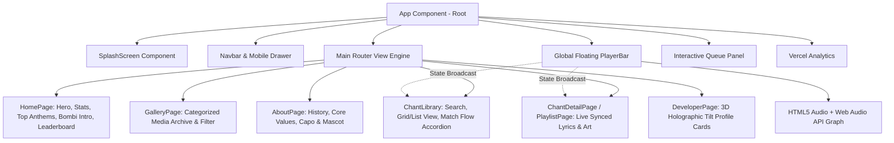
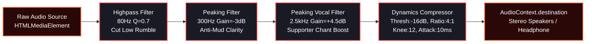
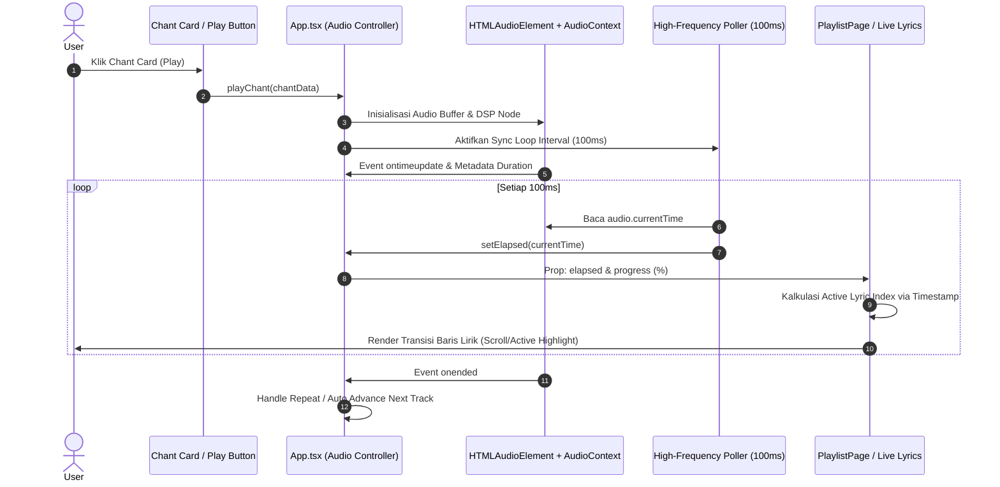
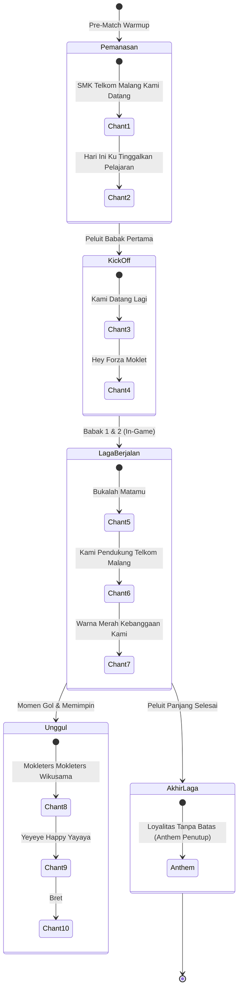

# <p align="center"><br/>🔥 MOKLETERS WEB CHANT PLATFORM 🔥</p>

<p align="center">
  <strong>"FIGHT TOGETHER • NEVER SURRENDER"</strong><br/>
  <em>Platform Digital & Perpustakaan Chant Resmi Suporter SMK Telkom Malang (Wikusama)</em>
</p>

<p align="center">
  
  
  
  
  
  
</p>

---

## 📌 Daftar Isi (Table of Contents)

1. [🌟 Tentang Proyek (About The Project)](#-tentang-proyek-about-the-project)
2. [✨ Fitur-Fitur Utama (Key Features)](#-fitur-fitur-utama-key-features)
3. [🏛️ Arsitektur Sistem & Diagram (System Architecture)](#️-arsitektur-sistem--diagram-system-architecture)
   - [3.1 Diagram Hirarki Komponen & Navigasi](#31-diagram-hirarki-komponen--navigasi)
   - [3.2 Web Audio API DSP Signal Chain](#32-web-audio-api-dsp-signal-chain)
   - [3.3 Alur Sinkronisasi Lirik Presisi Tinggi](#33-alur-sinkronisasi-lirik-presisi-tinggi)
   - [3.4 Alur Urutan Chant Tribun (Match Flow)](#34-alur-urutan-chant-tribun-match-flow)
4. [🛠️ Tech Stack & Spesifikasi](#️-tech-stack--spesifikasi)
5. [📂 Struktur Direktori Proyek](#-struktur-direktori-proyek)
6. [🎛️ Web Audio API DSP Deep Dive](#️-web-audio-api-dsp-deep-dive)
7. [🎶 Katalog Chant & Panduan Tribun](#-katalog-chant--panduan-tribun)
8. [🚀 Panduan Instalasi & Menjalankan](#-panduan-instalasi--menjalankan)
9. [📱 Responsivitas & Desain Antarmuka](#-responsivitas--desain-antarmuka)
10. [👥 Tim Pengembang (Developers)](#-tim-pengembang-developers)
11. [📜 Hak Cipta & Lisensi](#-hak-cipta--lisensi)

---

## 🌟 Tentang Proyek (About The Project)

**Mokleters** adalah platform web interaktif dan perpustakaan chant audio digital modern yang didedikasikan untuk seluruh suporter dan keluarga besar **SMK Telkom Malang**. Diciptakan dengan semangat kebersamaan dan loyalitas tanpa batas, platform ini dirancang khusus untuk mempermudah suporter (*Mokleters*) dalam mempelajari, menghafal lirik secara *real-time*, dan mendengarkan audio chant berkualitas tinggi langsung dari perangkat seluler maupun komputer.

### 🎯 Tujuan & Visi
- **Preservasi Budaya Tribun**: Mendokumentasikan seluruh chant dan lagu kebanggaan suporter dalam format digital berdefinisi tinggi.
- **Audio Clarity Enhancement**: Menjernihkan rekaman audio tribun yang bising menggunakan pemrosesan sinyal digital (*Digital Signal Processing*) berbasis peramban (*Web Audio API*).
- **Matchday Guide**: Memberikan panduan urutan chant (*Match Flow*) yang terstruktur dari *pre-match*, *kick-off*, *in-game tempo*, selebrasi kemenangan, hingga anthem penutup.
- **Identitas & Sejarah**: Menampilkan profil maskot legendaris **Bombi** (filosofi Tetuko / Gatotkaca cilik), galeri dokumentasi laga, serta kepemimpinan capo suporter.

---

## ✨ Fitur-Fitur Utama (Key Features)

| Kategori | Fitur | Deskripsi |
| :--- | :--- | :--- |
| 🎚️ **Audio Engine** | **Real-Time DSP Equalizer** | 4-Stage audio processing: Highpass rumble filter (80Hz), Mud notch (-3dB @ 300Hz), Vocal boost (+4.5dB @ 2.5kHz), dan Dynamic Compressor. |
| 🎤 **Lirik Karaoke** | **Time-Synced Dynamic Lyrics** | Sinkronisasi lirik presisi milidetik dengan *interpolated tick interval* (100ms) dan visualisasi lirik aktif (*karaoke-style focus*). |
| 📋 **Tribun Flow** | **Match Flow Interactive Guide** | Panduan alur chant pertandingan bertahap dengan integrasi *accordion* lirik instan dan pemutaran audio sekali klik. |
| 🎛️ **Pemutar Audio** | **Full-Control Global Player Bar** | Dilengkapi fitur *Shuffle*, *Repeat Track*, *Seek Slider*, *Realtime Volume Control*, *Fullscreen Mode*, serta *Queue Drawer*. |
| 🔍 **Pustaka & Filter** | **Dynamic Search & View Toggle** | Pencarian instan berbasis kata kunci (*fuzzy match*), filter kategori, dan pergantian mode tampilan (*Grid View* vs *List View*). |
| 🎴 **Interaktif 3D** | **3D Gyro/Mouse Tilt Profile Card** | Kartu profil tim pengembang dengan efek kemiringan 3D interaktif, lapisan *holographic glare*, dan pencahayaan dinamis. |
| 🖼️ **Galeri Visual** | **Categorized Photo Archive** | Arsip foto dokumentasi laga, koor tribun, koreografi, perkusi, dan maskot dengan format *modern optimized WebP*. |
| 📱 **Mobile UI/UX** | **PWA-Ready & Bottom Sheet** | Navigasi *mobile drawer*, *floating mini player bar*, *touch gesture support*, serta tema visual *dark mode* beraksen merah-emas. |

---

## 🏛️ Arsitektur Sistem & Diagram (System Architecture)

### 3.1 Diagram Hirarki Komponen & Navigasi



---

### 3.2 Web Audio API DSP Signal Chain

Platform ini menggunakan rangkaian pemrosesan suara digital secara *real-time* untuk mengubah rekaman mentah ponsel di tribun menjadi suara vokal yang tebal, jernih, dan tidak pekak:



---

### 3.3 Alur Sinkronisasi Lirik Presisi Tinggi



---

### 3.4 Alur Urutan Chant Tribun (Match Flow)



---

## 🛠️ Tech Stack & Spesifikasi

```
┌─────────────────────────────────────────────────────────────┐
│                       MOKLETERS STACK                       │
├───────────────────┬─────────────────────────────────────────┤
│ Core Framework    │ React 19 (v19.2.7)                      │
│ Language          │ TypeScript (v6.0.2)                     │
│ Build Tool        │ Vite (v8.1.1)                           │
│ Audio Processing  │ Web Audio API (BiquadFilter, Dynamics)  │
│ Telemetry         │ @vercel/analytics (v2.0.1)              │
│ Iconography       │ Lucide / Custom Inline Vector SVG       │
│ Typography        │ Bebas Neue (Display) & Inter (Body UI)  │
│ Styling Engine    │ Modular Vanilla CSS (Design Tokens/Var) │
│ Quality & Linter  │ ESLint 10 + TypeScript-ESLint           │
└───────────────────┴─────────────────────────────────────────┘
```

### Rincian Dependensi (`package.json`)
```json
{
  "dependencies": {
    "@vercel/analytics": "^2.0.1",
    "react": "^19.2.7",
    "react-dom": "^19.2.7",
    "react-icons": "^5.7.0"
  },
  "devDependencies": {
    "@eslint/js": "^10.0.1",
    "@types/node": "^24.13.2",
    "@types/react": "^19.2.17",
    "@types/react-dom": "^19.2.3",
    "@vitejs/plugin-react": "^6.0.3",
    "eslint": "^10.6.0",
    "eslint-plugin-react-hooks": "^7.1.1",
    "eslint-plugin-react-refresh": "^0.5.3",
    "typescript": "~6.0.2",
    "typescript-eslint": "^8.62.0",
    "vite": "^8.1.1"
  }
}
```

---

## 📂 Struktur Direktori Proyek

```
mokleters/
├── public/
│   ├── favicon.svg                  # Favicon aplikasi
│   ├── anthem1.webp ~ anthem3.webp  # Artwork kompresi anthem
│   ├── chant-art.webp               # Default album artwork
│   └── mp4/                         # Master audio track (M4A/MP4 container)
│       ├── LOYALITAS TANPA BATAS ANTHEM.m4a.mp4
│       ├── bret.m4a.mp4
│       ├── bukalah matamu.m4a.mp4
│       ├── hari ini ku tinggalkan pelajaran.m4a.mp4
│       ├── hey forza moklet forza forza moklet.m4a.mp4
│       ├── kami datang lagi.m4a.mp4
│       ├── kami pendukung telkom malang.m4a.mp4
│       ├── mokleters mokleters wikusama.m4a.mp4
│       ├── smk telkom malang kami datang.m4a.mp4
│       ├── warna merah kebanggan kami.m4a.mp4
│       └── yeyeye happy yayaya.m4a.mp4
├── src/
│   ├── assets/                      # Asset visual & gambar terkompresi
│   │   ├── Mokleters logo.png       # Logo resmi Mokleters
│   │   ├── bombi_optimized.webp     # Maskot resmi Bombi
│   │   ├── atta_optimized.webp      # Foto Capo Utama
│   │   ├── nabil_optimized.webp     # Foto Lead Developer
│   │   ├── elzidane_optimized.webp  # Foto Systems Engineer
│   │   ├── graffiti_optimized.webp  # Artwork banner graffiti
│   │   └── images/                  # Gallery WebP archive (DSC01919 s/d DSC02120)
│   ├── components/
│   │   ├── LogoLoop.tsx             # Komponen marquee logo bergulir tak terbatas
│   │   ├── ProfileCard.css          # Styling efek 3D tilt & holographic glare
│   │   ├── ProfileCard.tsx          # Komponen kartu 3D interaktif pengembang
│   │   └── SplashScreen.tsx         # Splash screen animasi saat memuat situs
│   ├── data/
│   │   └── lyrics.ts                # Master data chant, timestamp lirik, audio path & durasi
│   ├── pages/
│   │   ├── AboutPage.tsx            # Halaman sejarah, visi, Capo & filosofi Bombi
│   │   ├── ChantDetailPage.tsx     # Tampilan detail pemutar & sinkronisasi lirik
│   │   ├── ChantLibrary.tsx         # Halaman perpustakaan, pencarian & Match Flow
│   │   ├── DeveloperPage.tsx        # Halaman kartu profil tim pengembang
│   │   ├── GalleryPage.tsx          # Halaman galeri arsip visual dokumentasi
│   │   └── PlaylistPage.tsx         # Halaman pemutar audio imersif & lirik dinamis
│   ├── App.css
│   ├── App.tsx                      # Root component, state audio global & routing internal
│   ├── index.css                    # Design system global, variabel warna & utilitas
│   └── main.tsx                     # Entry point Vite & React DOM mounting
├── index.html                       # HTML skeleton, SEO meta tags & Google Fonts
├── package.json
├── tsconfig.json
└── vite.config.ts                   # Konfigurasi bundling Vite & React plugin
```

---

## 🎛️ Web Audio API DSP Deep Dive

Rekaman suara chant yang diambil di tribun stadion umumnya memiliki kendala akustik: **gemuruh angin frekuensi rendah (*sub-bass rumble*)**, **dengung ruang tertutup (*muddy mids*)**, dan **vokal suporter yang tertutup suara drum perkusi**. 

Untuk mengatasi masalah ini secara otomatis di sisi klien tanpa memerlukan file audio baru, `App.tsx` menyusun *DSP Chain Graph* berikut:

```typescript
// Cuplikan Implementasi Web Audio API di App.tsx
const ctx = audioCtxRef.current
const source = ctx.createMediaElementSource(audio)

// 1. Highpass Filter: Menghilangkan gemuruh di bawah 80Hz
const hpFilter = ctx.createBiquadFilter()
hpFilter.type = 'highpass'
hpFilter.frequency.value = 80
hpFilter.Q.value = 0.7

// 2. Anti-Muddy Filter: Meredam frekuensi keruh di 300Hz
const mudFilter = ctx.createBiquadFilter()
mudFilter.type = 'peaking'
mudFilter.frequency.value = 300
mudFilter.gain.value = -3

// 3. Supporter Vocal Booster: Memperjelas pekikan vokal chant di 2.5kHz
const vocalFilter = ctx.createBiquadFilter()
vocalFilter.type = 'peaking'
vocalFilter.frequency.value = 2500
vocalFilter.gain.value = 4.5

// 4. Dynamics Compressor: Menyeimbangkan dinamika dan mempertebal audio
const compressor = ctx.createDynamicsCompressor()
compressor.threshold.value = -16
compressor.ratio.value = 4
compressor.attack.value = 0.010
compressor.release.value = 0.150

// Menghubungkan rantai sinyal
source.connect(hpFilter)
hpFilter.connect(mudFilter)
mudFilter.connect(vocalFilter)
vocalFilter.connect(compressor)
compressor.connect(ctx.destination)
```

---

## 🎶 Katalog Chant & Panduan Tribun

| No | Judul Chant | Kategori | Tag | Durasi | Lirik Pembuka |
| :-: | :--- | :--- | :--- | :-: | :--- |
| **01** | **Kami Datang Lagi** | Chant Mokleters | Utama | 0:37 | *"Kami datang lagi, SMK Telkom Malang..."* |
| **02** | **SMK Telkom Malang Kami Datang** | Anthem Pembuka | Pembuka | 0:44 | *"SMK Telkom Malang, kami datang mendukungmu..."* |
| **03** | **Bukalah Matamu** | Tempo Pertandingan | Laga | 0:40 | *"Bukalah matamu, pasang telingamu..."* |
| **04** | **Mokleters Mokleters Wikusama** | Chant Kebanggaan | Kebanggaan | 0:36 | *"Mokleters Mokleters wikusama (oe oe o)..."* |
| **05** | **Kami Pendukung Telkom Malang** | Tempo Pertandingan | Laga | 0:39 | *"Kami pendukung Telkom Malang, di tribun bernyanyi..."* |
| **06** | **Loyalitas Tanpa Batas** | Anthem Mokleters | Anthem Penutup | 1:28 | *"Dengarlah kawan cerita dan semangatku..."* |
| **07** | **Hey Forza Moklet** | Tempo Pertandingan | Laga | 0:37 | *"Hari ini Telkom Malang berlaga, hari ini Telkom Malang pemenangnya..."* |
| **08** | **Bret** | Chant Kemenangan | Selebrasi | 1:10 | *"Wis sue aku ngenteni koe, rino wengi ora nyambut gawe..."* |
| **09** | **Yeyeye Happy Yayaya** | Chant Kemenangan | Selebrasi | 0:35 | *"Yeyeye happy yayaya, kami ini Telkom School Malang..."* |
| **10** | **Warna Merah Kebanggaan Kami** | Chant Kebanggaan | Kebanggaan | 0:39 | *"Warna merah kebanggaan kami, disini kami terus berdiri..."* |
| **11** | **Hari Ini Ku Tinggalkan Pelajaran** | Anthem Pembuka | Pembuka | 0:37 | *"Hari ini kutinggalkan pelajaran, siap-siap untuk nonton pertandingan..."* |

---

## 🚀 Panduan Instalasi & Menjalankan

### Persyaratan Awal (Prerequisites)
- [Node.js](https://nodejs.org/) (Versi 18.x atau lebih baru disarankan)
- Package Manager: `npm`, `pnpm`, atau `yarn`

### Langkah-Langkah

1. **Clone Repositori**
   ```bash
   git clone https://github.com/ElZidane123/mokleters.git
   cd mokleters
   ```

2. **Install Seluruh Dependensi**
   ```bash
   npm install
   ```

3. **Menjalankan Server Pengembangan (Development Server)**
   ```bash
   npm run dev
   ```
   > Buka tautan lokal yang muncul di terminal (biasanya `http://localhost:5173`) di browser Anda.

4. **Menjalankan Pengecekan Linting (ESLint)**
   ```bash
   npm run lint
   ```

5. **Membangun Bundel Produksi (Production Build)**
   ```bash
   npm run build
   ```
   > Hasil build yang teroptimasi akan diekspor ke folder `dist/`.

6. **Menguji Hasil Build Secara Lokal**
   ```bash
   npm run preview
   ```

---

## 📱 Responsivitas & Desain Antarmuka

Platform **Mokleters** dirancang dengan filosofi *Mobile-First* & *Ultra-Performance*:

- 🎨 **Palet Warna Tribun**: Dominasi latar belakang gelap (*Onyx & Charcoal*) dengan aksen merah membara (`#A10F12` & `#D7262E`), emas keemasan, dan teks putih bergradasi.
- 🪟 **Glassmorphism & Glow**: Sentuhan efek kaca semi-transparan berpadu dengan bayangan cahaya (*ambient glow*) bertema bara api suporter.
- 📐 **Adaptif Multi-Perangkat**:
  - **Desktop (>1024px)**: Player bar lengkap dengan progress bar tengah, slider volume dinamis, dan queue drawer.
  - **Tablet (768px - 1024px)**: Grid 2-kolom responsif dengan menu kompak.
  - **Mobile (<768px)**: Bottom floating mini-player bar, hamburger navigation drawer dengan gesture backdrop, dan kartu lirik berukuran pas jempol tangan.

---

## 👥 Tim Pengembang (Developers)

Proyek ini dirancang dan dikembangkan dengan penuh dedikasi oleh tim developer suporter SMK Telkom Malang:

<table align="center">
  <tr>
    <td align="center" width="50%">
      <br />
      <strong>M. Nabil Anwar K.</strong><br />
      <em>Lead Developer & UI Architect</em><br />
      <a href="https://github.com/nabilkencana"></a>
      <a href="https://www.instagram.com/nabill.anwr"></a>
      <br/><br/>
      <small>Merancang arsitektur antarmuka pengguna (UI), tema warna dinamis, dan sistem sinkronisasi lirik berkecepatan tinggi.</small>
    </td>
    <td align="center" width="50%">
      <br />
      <strong>Elzidane Ardyansyah</strong><br />
      <em>Fullstack & Systems Engineer</em><br />
      <a href="https://github.com/ElZidane123"></a>
      <a href="https://www.instagram.com/_elzdne"></a>
      <br/><br/>
      <small>Mengembangkan mesin Web Audio API DSP, sinkronisasi progres pemutar audio global, dan optimasi performa data.</small>
    </td>
  </tr>
</table>

---

## 📜 Hak Cipta & Lisensi

- Proyek ini dirilis dan didistribusikan untuk komunitas suporter **SMK Telkom Malang (Moklet)**.
- Seluruh hak cipta lagu, lirik, dan chant merupakan milik bersama keluarga besar **Mokleters & SMK Telkom Malang**.
- Dibuat dengan ❤️ dan semangat korsa membara oleh **Mokleters Dev Team 2026**.

<p align="center">
  <strong>🔴⚪ MOKLET BERSATU, TAK BISA DIKALAHKAN! ⚪🔴</strong>
</p>
